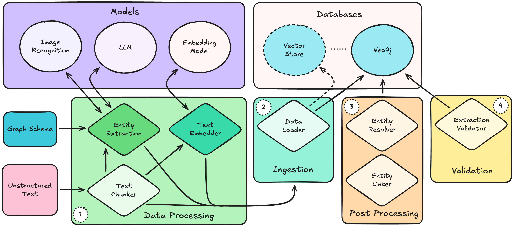
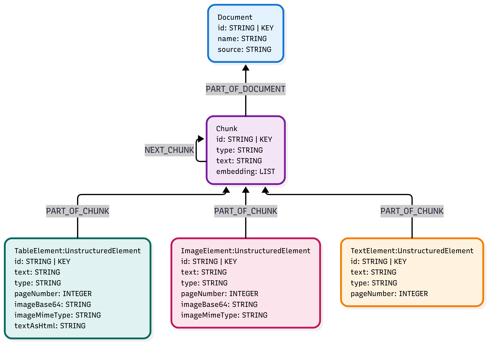

# PubMed Knowledge Graph

A comprehensive process for generating a knowledge graph from PubMed articles that integrates lexical data, extracted entities, and patient journey information to support healthcare research and analysis.

## Introduction

This project creates a knowledge graph by combining:

**Lexical Graph**: Document structure with chunks, text elements, images, and tables from PubMed articles

**Entity Graph**: Extracted healthcare entities including medications, treatment arms, clinical outcomes, study populations, and medical conditions

**Patient Journey Graph**: Real-world patient data including demographics, procedures, lab results, and outcomes

The system uses advanced document processing with Unstructured.IO, LLM-based entity extraction with OpenAI GPT-4, and Neo4j to create a comprehensive healthcare knowledge representation.

## Installation and Setup

### Prerequisites

#### Core
- Python 3.11 or higher
- Neo4j Database (local or remote instance)
- OpenAI API key for entity extraction

#### Unstructured.IO Local Processing
- Poppler library for PDF processing
- Tesseract OCR engine

### Environment Setup

1. **Clone the repository:**
   ```bash
   git clone https://github.com/cupkes/pubmed-knowledge-graph.git
   cd pubmed-knowledge-graph
   ```

2. **Install dependencies for local PDF processing:**
    * [pdf2image Documentation](https://pypi.org/project/pdf2image/) (Uses Poppler)

    * [Tesseract Documentation](https://tesseract-ocr.github.io/tessdoc/Installation.html)

   ```bash
   # macOS
   brew install poppler tesseract
   
   # Ubuntu/Debian
   sudo apt-get install poppler-utils tesseract-ocr
   
   # Windows
   # Install poppler and tesseract manually or via conda
   ```

3. **Install Python dependencies using Poetry (recommended):**
   ```bash
   make install
   ```

   **Or using pip:**
   ```bash
   make install-pip
   ```

4. **Neo4j Database Configuration:**
   - Install and start Neo4j locally, or use a remote instance
   - Update `pyneoinstance_config.yaml` with your database credentials:
     ```yaml
     db_info:
       uri: bolt://localhost:7687
       database: your-database-name
       user: neo4j
       password: your-password
     ```

5. **OpenAI API Configuration:**
   - Set your OpenAI API key as an environment variable:
      * Using `export` 
     ```bash
     export OPENAI_API_KEY=your-api-key-here
     ```
     * Using `.env` file
       * Create a file in project root named `.env`
       * Add OPENAI_API_KEY=your-api-key

6. **Data Preparation:**
   - Confirm PubMed PDF articles are in the `articles/pdf/` directory
   - Ensure patient journey data is available in `data/protocol/extended_patient_journey.csv`

## Knowledge Graph Generation



These notebooks demonstrate the knowledge graph generation process in four primary steps:

1. Data Processing

Here we chunk the incoming PDF articles, extract images, tables and entities, and embed the text.

A predefined graph schema is used to extract entities and relationships of interest.

2. Ingestion

We then load the chunks, entities, relationships and embeddings into Neo4j. Optionally we can load the embeddings into a vector store and synchronize the embeddings with their respective text in Neo4j via IDs.

3. Post Processing

Here we execute Cypher queries to resolve duplicate entities we've extracted. This process is custom for each entity type we would like to resolve.

We also can link entities to nodes in our patient journey graph. This is also achieved via Cypher queries, but there are many methods that many be used for entity linking.

4. Validation

Finally we can validate that the entity extraction process went as expected. This involves running multiple Cypher queries and aggregating the results in an analysis report. We can check features such as orphan nodes, expected relationships and property presence. 

## Notebooks

The knowledge graph generation process is divided into three sequential notebooks that should be executed in order:

### 1. Patient Journey Graph (`1_generate_patient_graph.ipynb`)

**Purpose**: Establishes the foundational patient journey graph with simulated healthcare data.

**What it does**:
- Loads structured patient journey data from CSV files
- Creates Member, Demographic, MedicalCondition, Procedure, LabResult, and ClinicalOutcome nodes
- Establishes relationships between patients and their healthcare journey components
- Sets up constraints and indexes for the entire graph database

### 2. Lexical Graph (`2_generate_lexical_graph.ipynb`)

**Purpose**: Processes PubMed articles to create a detailed lexical knowledge graph.

**What it does**:
- Partitions PDF articles using Unstructured.IO with high-resolution processing
- Extracts text, images, and tables from documents using advanced OCR
- Creates Document, Chunk, TextElement, ImageElement, and TableElement nodes
- Builds relationships between documents and their constituent parts
- Implements chunking strategy based on document titles and sections

### 3. Entity Graph (`3_generate_entity_graph.ipynb`)

**Purpose**: Extracts healthcare entities from the lexical graph using LLM-based processing and connects them to lexical and patient journey data.

**What it does**:
- Uses an OpenAI LLM with Instructor library for structured entity extraction
- Extracts Medication, TreatmentArm, ClinicalOutcome, StudyPopulation, and MedicalCondition entities
- Creates relationships between extracted entities
- Links extracted entities to their source text chunks via HAS_ENTITY relationships
- Connects entity graph to patient journey graph
- Performs entity resolution to merge duplicate medications

## Data Models

The system implements three interconnected data models:

### Lexical Data Model
- **Document**: Top-level container for articles with metadata
- **Chunk**: Semantic sections of documents created by title-based chunking
- **UnstructuredElement**: Base class for TextElement, ImageElement, and TableElement
- **Relationships**: Document → Chunk → Elements with sequential chunk linking



### Entity Data Model
- **Medication**: Drug information with classification, mechanism, and approval status
- **TreatmentArm**: Study groups receiving specific treatments with unique identifiers
- **ClinicalOutcome**: Measured results from treatments linked to studies
- **StudyPopulation**: Patient demographics and study characteristics with inclusion/exclusion criteria
- **MedicalCondition**: Diseases and conditions with ICD-10 validation


### Patient Journey Data Model
- **Member**: Individual patients with unique identifiers
- **Demographic**: Age, sex, and ZIP code information with composite constraints
- **Procedure**: Medical procedures with CPT codes and dates
- **LabResult**: Laboratory test results with LOINC codes and values
- **Clinical outcomes and medication relationships with temporal data**


## Entity Extraction Validation

The entity extraction process may be validated with `scripts/validate_entity_graph.py`

- **Node Count Validation**: Ensures expected entity quantities across all graph layers
- **Relationship Integrity**: Validates all expected connections exist between node types
- **Orphan Detection**: Identifies isolated nodes without relationships for quality control
- **Domain vs. Lexical Relationship Balance**: Ensures proper connectivity between research and real-world data

Run validation with:
```bash
make validate-graph-poetry
# or
make validate-graph-pip
```

## Troubleshooting

### Common Issues

1. **OpenAI API Errors**: 
   - Ensure API key is set: `echo $OPENAI_API_KEY`
   - Verify sufficient API credits and rate limits
   - Check for API endpoint availability

2. **Neo4j Connection**: 
   - Verify Neo4j service is running: `neo4j status`
   - Test connection credentials in Neo4j Browser
   - Check network connectivity and firewall settings

3. **PDF Processing Warnings**: 
   - "Cannot set gray non-stroke color" warnings are non-fatal
   - Ensure poppler and tesseract are properly installed
   - Verify PDF files are not corrupted

## LangGraph Agent Interface

The project includes an interactive LangGraph-based agent that provides a conversational interface for querying the knowledge graph and researching medications.

### Description

The agent (`agent.py`) is a React-style agent that uses Neo4j Cypher querying capabilities to research and analyze medications, studies and patients. It acts as a healthcare expert that can answer questions by dynamically querying the knowledge graph and provides cited responses based on the underlying documents and structured patient data.

### Tools Available

The agent uses the [Neo4j Cypher MCP server](https://github.com/neo4j-contrib/mcp-neo4j/tree/main/servers/mcp-neo4j-cypher) to understand the data model schema and execute read-only Cypher queries.

The agent has access to three primary tools:

1. **get_neo4j_schema** - Retrieves the database schema to inform Cypher query construction
2. **read_neo4j_cypher** - Executes read-only Cypher queries against the knowledge graph
3. **research_medication** - Performs vector similarity search to find relevant document chunks about specific medications

### Interface (CLI)

To use the agent, run:

```bash
make run-agent-poetry
# or
make run-agent-pip
```

The agent provides an interactive command-line interface where you can:
- Ask questions about medications, diseases, treatments, or patients
- Request specific information about drugs in the knowledge graph
- Get cited responses with references to source documents

Example queries:
- "What are the side effects of metformin?"
- "How can metformin affect my patient who is male and 65 years old?"
- "What medications interact with warfarin?"

Type `exit`, `quit`, or `q` to end the session.

---

This system provides a robust foundation for healthcare research, clinical decision support, and pharmaceutical research by combining structured patient data with comprehensive literature analysis in a unified, queryable graph representation.